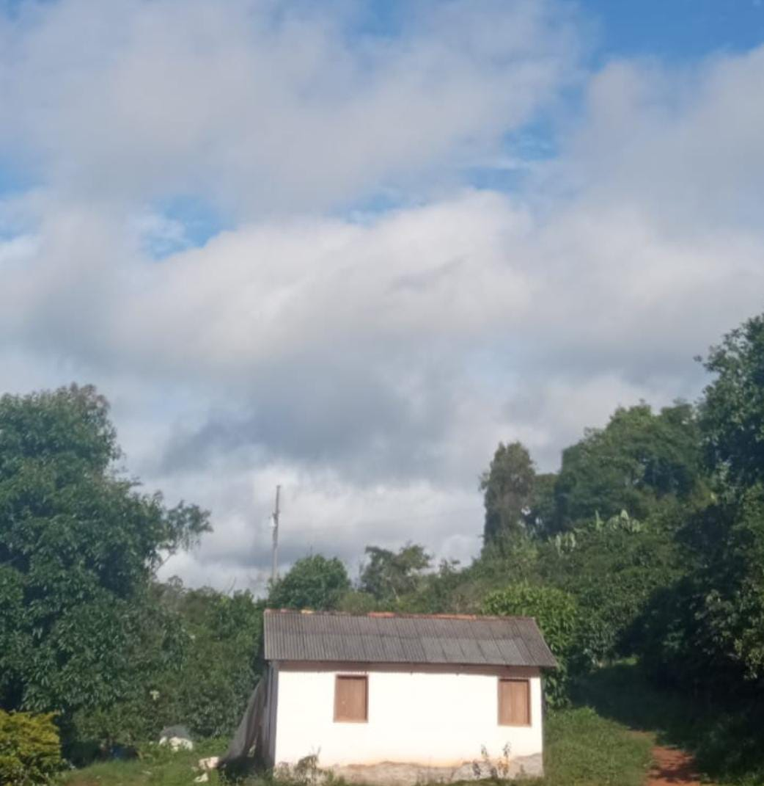
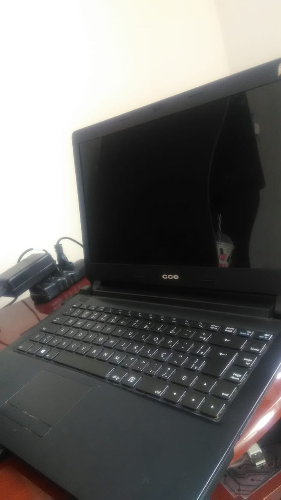

# Minha Jornada na Carreira da Programação

Olá, eu sou LEONE DUARTE! 👋 Essa é minha história, e pode não ser boa, mas espero que te faça rir pelo menos.

## Sobre Mim

Comecei minha jornada na programação há 9 anos. Estaria mentindo se dissesse que era o que sempre quis, visto que aos 15 anos nunca tinha visto uma TV e meu primeiro contato com a internet foi aos 16 anos. Mesmo assim, era um contato esporádico em uma lan house para fazer trabalhos escolares. Sabia pesquisar no Google no máximo. Então, não pense que você está atrasado para alguma coisa. Morar no interior sempre tem suas peculiaridades, porém fui abençoado com aspectos interessantes. Primeiro, na minha casa não existe nenhum tipo de sinal móvel. Temos que andar cerca de 15 minutos para ter um sinal mínimo, e o local torna a instalação de internet inviável. Acredite que já briguei com a empresa de internet pela chance de eles irem lá instalar, mas o local é muito remoto e a internet via satélite é muito cara.

### MEUS ESTUDOS

Tá, esse é um assunto importante, eu estudei em uma escola que tinha 15 alunos, isso mesmo, o total de alunos da escola era 15, e a escola tinha uma cozinha e dois cômodos, então o contato com o mundo era bem limitado. Fiz todo meu primário ali. ZERO CONTATO COM TECNOLOGIA, INTERNET, NEM COMPUTADOR TINHA LÁ.

## Mas como conheci a T.I.? 

Tive um professor de informática na escola pública, no ensino fundamental, chamado Cleiton. Por vezes, eu demonstrava interesse em mexer nos computadores e até consertar alguns, e ele me deixava mexer durante as aulas. Sempre gostava de mexer mais neles. Então, essas aulas foram uma ótima forma de iniciar. Lembrando que não havia internet na escola. Tínhamos alguns computadores com o Ubuntu escolar instalado, e ali descobri que tinha um pouco de habilidade com computadores. Um grande agradecimento ao Cleiton, vulgo Tio Cleiton, por me apresentar esse mundo, para um cara que nem sabia o que dava para fazer em um computador. Sei nem se dá pra dizer que era T.I., acho que era só mexer em computador mesmo.

## RESUMINDO 

Olhando as probabilidades e a lógica, hoje eu estaria trabalhando na roça. Não que haja algo errado nisso, mas não me leve a mal, eu odiava. É um serviço que te deixa destruído ao final de cada dia, e os riscos envolvidos, acredite, quando se mexe com plantações, você tem medo da chuva, porque pode chover demais ou de menos e aí arruinar a colheita, do sol, porque se der sol demais ou de menos também, das pragas, do vento, de você, e se ficar doente, como faz então? Sim, é uma vida sofrida, de certa forma, mas que com certeza não era o que queria. 

**UMA DICA IMPORTANTE:** Caso você chegue numa situação onde você não sabe o que quer da vida, foque no que você não quer fazer, que já ajuda. Enfim, as probabilidades são bem ruins nesse sentido para que eu fosse da tecnologia, sem internet, sem acesso a informação, cidade mais próxima a 12km e só dava para eu ir lá de bicicleta, acredite, eu ia. Eu mentia para os meus pais que ia para igreja, porque assim eles deixavam, mas aí ia para lan house, pow, 1 real a hora, eu ficava até fechar. Às vezes, eu estava na porta da lan house esperando ela abrir domingo de manhã, mas deveria estar na missa, que eu não gostava de ir, por sinal.

## PRIMEIRA COLHEITA 🌾

Na minha primeira colheita, comprei um notebook, esse lazarento que está abaixo, e por incrível que pareça, ele ainda funciona e está inteiro. Para quem fala mal da cce, está aí o exemplo de guerreiro. Ele custou 700 reais, o que você pode pensar que é pouco, mas para mim custou mais de duas sacas de café. Eu tinha 5 para lidar com as despesas do ano, então era caro. Vinha com Linux e, acredite, eu mexia nele sem internet, porque não tinha. Isso explica minhas habilidades com . Aprendi tudo porque, como não tinha internet nele, eu ficava fuçando e mexendo e aí descobri. Então sim, o primeiro sistema operacional que mexi foi Linux. As poucas vezes que tive contato com Windows na época era na lan house.

## PRIMEIROS CÓDIGOS

Se me zoarem por essa parte, vocês não vão para o céu, então vamos lá! Meu irmão tinha livros da Microlins em casa. Se você nasceu depois de 2000, saiba que a Microlins era tipo uma escola que ensinava informática básica. Isso devia estar em todo o Brasil, porque numa cidade que tinha uns 6 mil habitantes, tinha. Eles tinham uns livros que li uma vez por curiosidade, e lá estava: HTML e CSS básico. Aí peguei meu CCE, vulgo "Alenda", e fiz uns códigos usando o Bloco de Notas. Sim, nem sabia o que era IDE, mas sabia o que era programação. Nossa, eu escrevi um site feio de horroroso, só com HTML, e ficava brincando com aquilo. Estava me achando o Hackerman.

AGUARDE AINDA ESTOU ESCREVENDO...
